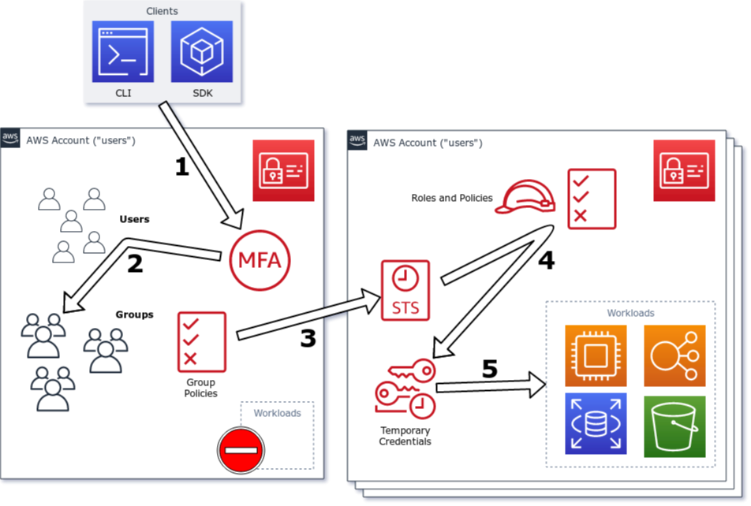
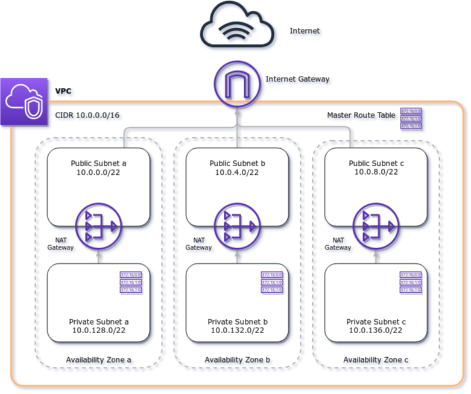

# AWS Core Modules

This is a collection of Terraform "core" modules I would consider to be building blocks of every reasonable AWS account setup.

## Available modules
- [config](#config)
- [iam-resources](#iam-resources)
- [iam-users](#iam-users)
- [vpc](#vpc)

## `config`

The module configures AWS Config to monitor your account for non-compliant resources for the following checks:

- **INSTANCES_IN_VPC**: All instances need to be started in a VPC (the default since years)
- **EC2_VOLUME_INUSE_CHECK**: All volumes need to be attached (otherwise they cost money for nothing)
- **EIP_ATTACHED**: All EIPs need to be attached (otherwise they cost money)
- **ENCRYPTED_VOLUMES**: All volumes in the account need to be encrypted
- **INCOMING_SSH_DISABLED**: No Security Group has port 22 open to the world
- **CLOUD_TRAIL_ENABLED**: CloudTrail is enabled in the account
- **CLOUDWATCH_ALARM_ACTION_CHECK**: You need to at least have an action for the state "Alarm" defined
- **IAM_GROUP_HAS_USERS_CHECK**: Every group in IAM needs to have users attached to it
- **IAM_PASSWORD_POLICY**: Account needs to have a password policy, with a certain complexity and it has to be enforced
- **IAM_USER_GROUP_MEMBERSHIP_CHECK**: A list of groups IAM users have to be a part of
- **IAM_USER_NO_POLICIES_CHECK**: None of your users should have policies attached to them directly, use groups/roles for that
- **ROOT_ACCOUNT_MFA_ENABLED**: Your root account needs to have MFA enabled
- **S3_BUCKET_PUBLIC_READ_PROHIBITED**: S3 buckets shouldn't be open to the public
- **S3_BUCKET_PUBLIC_WRITE_PROHIBITED**: S3 buckets shouldn't be publicly writable
- **S3_BUCKET_SSL_REQUESTS_ONLY**: S3 buckets must only allow TLS traffic (through bucket policies)
- **S3_BUCKET_SERVER_SIDE_ENCRYPTION_ENABLED**: S3 buckets must have SSE enabled
- **S3_BUCKET_VERSIONING_ENABLED**: S3 bucket versioning has to be enabled
- **EBS_OPTIMIZED_INSTANCE**: All instances run on EBS-optimized storage
- **ACCESS_KEYS_ROTATED**: All your access keys need to be rotated after a certain while
- **APPROVED_AMIS_BY_TAG**: Only allow AMIs with a certain tag for EC2 instances
- **AUTOSCALING_GROUP_ELB_HEALTHCHECK_REQUIRED**: AutoScalingGroups must be attached to an LB and have health checks enabled
- **DESIRED_INSTANCE_TYPE**: Only allow for certain instance types to be used
- **RDS_INSTANCE_PUBLIC_ACCESS_CHECK**: RDS instances must not be publicly accessible
- **RDS_SNAPSHOTS_PUBLIC_PROHIBITED**: RDS snapshots must not be public
- **IAM_POLICY_NO_STATEMENTS_WITH_ADMIN_ACCESS**: None of your policies allow for administrative privilege escalation
- **IAM_ROOT_ACCESS_KEY_CHECK**: Your root account must not have any security credentials attached to it

Some of them can receive extra parameters. See a table reference below.

### Example

Add the following statement to your `variables.tf` to use the `config` module in version `v0.3.13`:

```terraform
module "aws_config" {
  source = "git::https://github.com/moritzheiber/terraform-aws-core-modules.git//config?ref=v0.3.13"

  # Optional, defaults to "aws-config"
  bucket_prefix = "my-aws-config-bucket"
  # Optional, you should disable it for testing purposes, otherwise you will have trouble removing the S3 bucket again
  enable_lifecycle_management_for_s3 = false
}
```

and run `terraform init` to download the required module files.

### Prerequisites
* Terraform (`>= 0.12.6`)
* `aws` provider (`>= 2.20.0`)

### Input Variables
| Variable | Type | Default | Description |
|----------|------|---------|-------------|
| **`amis_by_tag_key_and_value_list`** | list(string) | `[]` | Required AMI tags for EC2 instances |
| **`bucket_account_id`** | string | `""` | The AWS account ID the S3 bucket lives in that AWS Config is writing its records to. Defaults to the ID of the current account |
| **`bucket_key_prefix`** | string | `"aws_config"` | The prefix of the keys AWS Config writes to |
| **`bucket_prefix`** | string | `"aws-config"` | The prefix for the S3 bucket AWS Config Recorder writes to |
| **`config_delivery_channel_name`** | string | `"config"` | The name of the delivery channel for AWS Config |
| **`config_recorder_name`** | string | `"config"` | The name of the recorder for AWS Config |
| **`delivery_frequency`** | string | `"Three_Hours"` | The frequency at which AWS Config delivers its recorded findings to S3 |
| **`desired_instance_types`** | set(string) | `[]` | A string of comma-delimited instance types |
| **`enable_lifecycle_management_for_s3`** | bool | `true` | Whether or not to enable lifecycle management for the S3 bucket AWS Config writes to |
| **`iam_role_name`** | string | `"config"` | The name of the IAM role created for delegating permissions to AWS Config |
| **`iam_user_groups`** | list(string) | `[]` | A list of mandatory groups for IAM users |
| **`max_access_key_age`** | string | `"90"` | The maximum amount of days an access key can live without being rotated |
| **`password_policy`** | map(string) | `{}` | A map of values describing the password policy parameters AWS Config is looking for |
| **`s3_kms_sse_encryption_key_arn`** | string | `""` | The ARN for the KMS key to use for S3 server-side bucket encryption |
### Output Values
| Variable | Description |
|----------|-------------|
| **``config_s3_bucket_id``** | The ID of the S3 bucket AWS Config writes its findings into |
## `iam-resources`

A module to configure the "resources" account modeled after a common security principle of separating users from resource accounts through a MFA-enabled role-assumption bridge.

### Example
```terraform
module "iam_resources" {
  source            = "git::https://github.com/moritzheiber/terraform-aws-core-modules.git//iam-resources?ref=v0.3.13"
  iam_account_alias = "my_unique_alias"
}

```

### Prerequisites
* Terraform (`>= 0.12.6`)
* `aws` provider (`~> 2.20.0`)

### Input Variables
| Variable | Type | Default | Description |
|----------|------|---------|-------------|
| **`admin_access_role_name`** | string | `"resource-admin"` | Name of the admin role |
| **`admin_multi_factor_auth_age`** | string | `"3600"` | The amount of time (in seconds) for a admin session to be valid |
| **`iam_account_alias`** | string | (required) | A globally unique identifier, human-readable for your AWS account |
| **`set_iam_account_alias`** | bool | `true` | Whether or not to set the account alias (useful to set to false when iam-users and iam-resources module are being deployed into the same account) |
| **`user_access_role_name`** | string | `"resource-user"` | Name of the user role |
| **`user_multi_factor_auth_age`** | string | `"14400"` | The amount of time (in seconds) for a user session to be valid |
| **`users_account_id`** | string | `""` | The account ID of where the users are living in |
### Output Values
| Variable | Description |
|----------|-------------|
| **``resource_admin_role_arn``** | The ARN of the role users are able to assume to attain admin privileges |
| **``resource_admin_role_name``** | The name of the role users are able to assume to attain admin privileges |
| **``resource_user_role_arn``** | The ARN of the role users are able to assume to attain user privileges |
| **``resource_user_role_name``** | The name of the role users are able to assume to attain user privileges |
## `iam-users`

A module to configure the "users" account modeled after a common security principle of separating users from resource accounts through a MFA-enabled role-assumption bridge:



This is modeled after a strict separation of privilege, as explained in [an article I wrote a while ago](https://www.thoughtworks.com/insights/blog/using-aws-security-first-class-citizen).

You can also create IAM users and IAM groups with this module and assign the users to specific groups. The module will create two default groups, one for admins and users, which you can disable by setting the `admin_group_name` and `user_group_name` to an empty string.

Creating additional users is done by passing a map called `users` to the module, with a group mapping attached to them (the best practice is to never have users live "outside" of groups).

_Usually you will want to use this module together with [`iam-resources`](#iam-resources) module._

### Example

```terraform
variable "iam_users" {
  type = map(map(list(string)))
  default = {
    my_user = {
      groups = ["admins"]
    }
  }
}

module "iam_users" {
  source            = "git::https://github.com/moritzheiber/terraform-aws-core-modules.git//iam-users?ref=v0.3.13"
  iam_account_alias = "my_unique_alias"

  iam_users = var.iam_users
}

This will run the module and create all the necessary permissions along with a user belonging to the `admins` groups.
```

### Prerequisites
* Terraform (`>= 0.12.6`)
* `aws` provider (`~> 2.20.0`)

### Input Variables
| Variable | Type | Default | Description |
|----------|------|---------|-------------|
| **`additional_admin_groups`** | list(string) | `[]` | A list of additional groups to create associated with administrative privileges |
| **`additional_user_groups`** | list(string) | `[]` | A list of additional groups to create associated with regular users |
| **`admin_group_name`** | string | `"admins"` | The name of the initial group created for administrators |
| **`iam_account_alias`** | string | (required) | A globally unique identifier, human-readable for your AWS account |
| **`iam_users`** | map(map(list(string))) | `{}` | A list of maps of users and their groups. Default is to create no users. |
| **`multi_factor_auth_age`** | string | `"14400"` | The amount of time (in seconds) for a user session to be valid |
| **`password_policy`** | map(string) | `{}` | A map of password policy parameters you want to set differently from the defaults |
| **`resource_admin_role_name`** | string | `"resource-admin"` | The name of the administrator role one is supposed to assume in the resource account |
| **`resource_user_role_name`** | string | `"resource-user"` | The name of the user role one is supposed to assume in the resource account |
| **`resources_account_id`** | string | `""` | The account ID of the AWS account you want to start resources in |
| **`set_iam_account_alias`** | bool | `true` | Whether or not to set the account alias (useful to set to false when iam-users and iam-resources module are being deployed into the same account) |
| **`user_group_name`** | string | `"users"` | The name of the initial group created for users |
### Output Values
| Variable | Description |
|----------|-------------|
| **``admin_group_names``** | The names of the admin groups |
| **``user_group_names``** | The name of the user groups |
## `vpc`

The module builds a VPC with the default CIDR range of `10.0.0.0/16`, three subnets a "public" configuration (attached and routed to an AWS Internet Gateway) and three subnets in a "private" configuration (attached and routed through three separate AWS NAT Gateways):



### Example

Add the following statement to your `variables.tf` to use the `vpc` module in version `v0.3.13`:

```terraform
module "core_vpc" {
  source = "git::https://github.com/moritzheiber/terraform-aws-core-modules.git//vpc?ref=v0.3.13"

  tags = {
    Resource    = "my_team_name"
    Cost_Center = "my_billing_tag"
  }
}
```

and run `terraform init` to download the required module files.

All created **subnets will have a tag created for them which specifies their scope** (i.e. "public" for public subnets and "private" for private subnets) which you can filter on using Terraform data sources:

```terraform
data "aws_vpc" "core" {
tags = {
    # `core_vpc` is the default, the variable is `vpc_name`
    Name = "core_vpc"
  }
}

data "aws_subnet_ids" "public" {
  vpc_id = data.aws_vpc.core.id

  tags = {
    Scope = "public"
  }
}

data "aws_subnet_ids" "private" {
  vpc_id = data.aws_vpc.core.id

  tags = {
    Scope = "private"
  }
}
```

The result is a list of subnet IDs you can use to create other resources such as Elastic Load Balancers or AutoScalingGroups.

### Prerequisites
* Terraform (`>= 0.12.6`)
* `aws` provider (`~> 2.20.0`)

### Input Variables
| Variable | Type | Default | Description |
|----------|------|---------|-------------|
| **`enable_dns_hostnames`** | bool | `true` | Whether or not to enable VPC DNS hostname support |
| **`enable_dns_support`** | bool | `true` | Whether or not to enable VPC DNS support |
| **`private_subnet_cidrs`** | list(string) | `[]` | A list of CIDRs for the private subnets. Needs to be the same amount as subnets in the Availability Zone you are deploying into (probably 3) |
| **`private_subnet_offset`** | number | `32` | The amount of IP space between the public and the private subnet |
| **`private_subnet_prefix`** | string | `""` | The prefix to attach to the name of the private subnets |
| **`private_subnet_size`** | number | `6` | The size of the private subnet (default: 1022 usable addresses) |
| **`public_subnet_cidrs`** | list(string) | `[]` | A list of CIDRs for the public subnets. Needs to be the same amount as subnets in the Availability Zone you are deploying into (probably 3) |
| **`public_subnet_prefix`** | string | `""` | The prefix to attach to the name of the public subnets |
| **`public_subnet_size`** | number | `"6"` | The size of the public subnet (default: 1022 usable addresses) |
| **`tags`** | map(string) | `{}` | A map of tags to apply to all VPC resources |
| **`vpc_cidr_range`** | string | `"10.0.0.0/16"` | The IP address space to use for the VPC |
| **`vpc_name`** | string | `"core_vpc"` | The name of the VPC |
### Output Values
| Variable | Description |
|----------|-------------|
| **``private_subnet_ids``** | A list of private subnet IDs |
| **``public_subnet_ids``** | A list of public subnet IDs |
| **``vpc_id``** | The ID of the created VPC |
